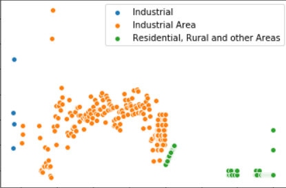

# Analyzing Air Pollution in Delhi
Air Pollution in Delhi over the past 25 years using python, pandas, numpy,matplotlib and seaborn libraries.
 

Involving data cleaning and data exploration.

The dataset is available at data.gov.in and I have also added the dataset file.

### Dataset Snapshot

The project involves- 
a) Data Cleaning 
b) Data Processing 
c) Data Visualization 

 
For data visualization I use- 

a) scatter plot               |  b) dist plot 
:-------------------------:|:-------------------------:
  |  

c) kde plot               |  d) dense plot 
:-------------------------:|:-------------------------:
  |  
 libra
